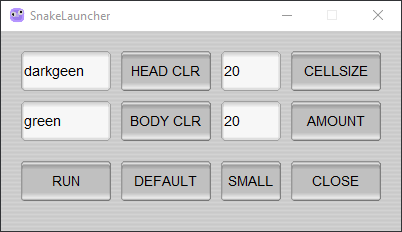
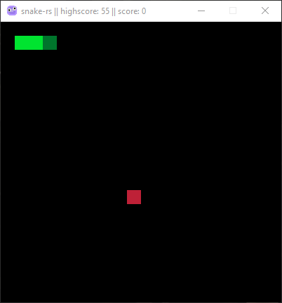

 
# what is this?
**this is a simple snake game made in rust raylib bindings :apple::snake:** 
**the game comes with a launcher made fltk bindings, the launcher let you controls snake color && cell size,amount** 
also the game icon creature is real and his name is bob 

# why?
**game made for learning purposes (rust && raylib bindings)** 
note: if you encountered a bug feel free to open an issue :]

# features
• **the score and highscore is displayed in the windows title**

• **color your own snake with various different colors :sparkles::fire:**

### launcher-gui:

### snake-game:

# authors
**klachnkov: https://github.com/kosatkanull**

# credits
**game-framework: https://github.com/deltaphc/raylib-rs** 
**gui-framework: https://github.com/fltk-rs/fltk-rs**

# License
this licensed under the Apache-2.0 license or the MIT license, at your option.

